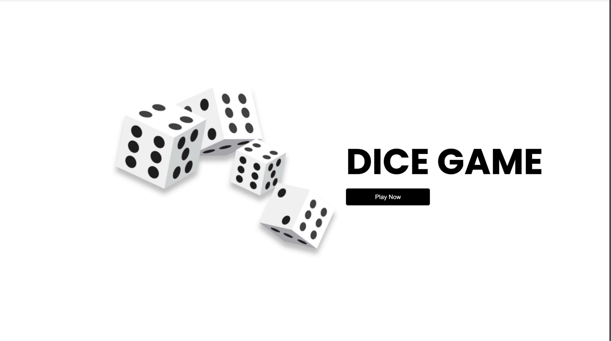
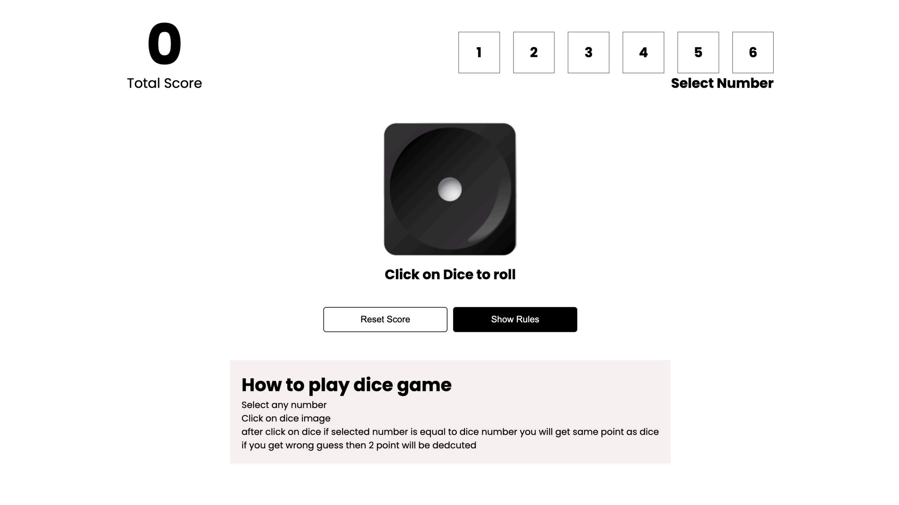

# 🎲 Dice Game

A simple and fun Dice Game built with **React**, **Vite**, and **Styled Components**. This project is fully responsive and optimized for all screen sizes, providing a seamless gaming experience on desktop, tablet, and mobile devices.

## 🖼️ Screenshots


*Roll Dice on Desktop*


*Responsive Layout Play Game Page*

## ✨ Features

- **Responsive Design**: Enjoy the game on any device, as the layout adapts to different screen sizes.
- **Interactive UI**: Built with **React** and **JSX** for smooth and interactive gameplay.
- **Styling**: Styled with **Styled Components** for easy customization and dynamic styling.
- **Fast & Lightweight**: Powered by **Vite** for fast development and optimized performance.

## 🛠️ Technologies Used

- **React** - A JavaScript library for building user interfaces
- **Vite** - A fast and lightweight build tool for modern web projects
- **Styled Components** - CSS-in-JS styling solution for component-based styling
- **JavaScript (JSX)** - JavaScript with XML-like syntax for rendering UI

## 🚀 Getting Started

Follow these steps to set up and run the project locally:

### Prerequisites

- **Node.js** and **npm** installed on your machine

### Installation

1. Clone this repository:
   ```bash
   git clone https://github.com/pareshsutharr/react-dice-game.git
